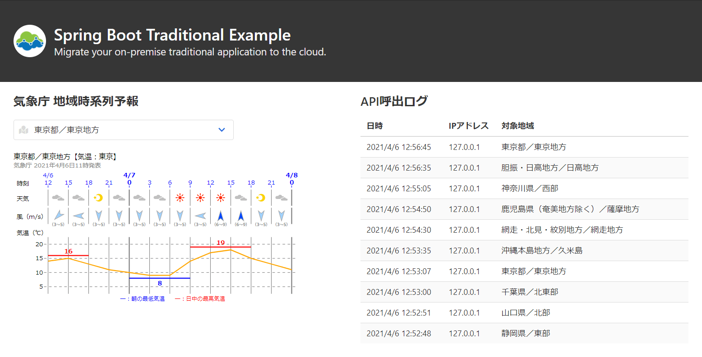
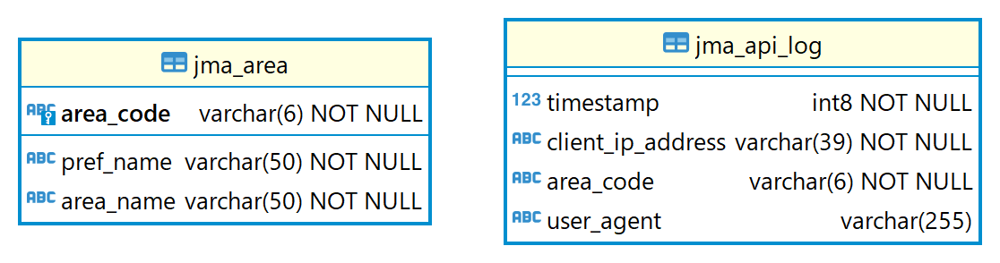

# Spring Boot Traditional Example

Spring Bootを使用した従来型のシンプルなアプリケーション

* プルダウンで選択した地域の気象庁時系列予報（JSON）をWeb APIで取得してSVGで描画
* プルダウンの地域情報はRDBMSのマスタテーブル（`jma_area`）から参照
* APIの呼出履歴はRDBMSのトランザクションテーブル（`jma_api_log`）に保存

**スクリーンショット：**


**データベースER図：**


**デフォルトで使用可能（同梱済）なJDBCドライバ：**

* PostgreSQL JDBC Driver
* MariaDB Connector/J（MySQL互換 ※OSSライセンスの関係でMySQL Connector/Jは同梱不可）
* Microsoft JDBC Driver for SQL Server

## ビルド手順

アプリケーションは、Fat-JAR/Uber-JAR（1つのJARファイルに依存ライブラリも含めたアプリケーションのすべてを格納する形式）でビルドする。Fat-JARには、アプリケーションサーバ（Tomcat）も同梱されるため、別途アプリケーションサーバを用意しなくても実行が可能である。

Spring BootはWARファイルとしてビルドすることも可能だが、特別な理由がなければFat-JAR形式を利用するのが望ましい。

| Fat-JARにする理由 | WARにする理由 |
| --- | --- |
| ・実行環境に対する依存関係がJREのみとなり、開発/本番の環境差異に起因する問題が発生するリスクが低い<br>・本番環境で使用するものと同様のアプリケーションサーバを使用してテストが実施可能（特にxUnitでのITは有効） | ・Java EEサーバの機能が必要（JBoss、WebLogic、WebSphere...）<br>・実行環境にアプリケーションサーバが稼働しており、リソースの制約で別インスタンスではなく別のWebアプリとして同居させたい |

### 前提条件

* Gitがインストールされパスが通っていること
* JDKバージョン11以上がインストールされパスが通っていること

### (1) Gradleでアプリケーションをビルド

以下のコマンドを実行することで、`build\libs`ディレクトリにアプリケーションのJARファイルが生成される。

```bash
git clone https://github.com/t-tsutsumi-scc/spring-boot-traditional-example.git
cd spring-boot-traditional-example
./gradlew bootJar
```

## 実行環境構築手順

Linuxのプロセスマネージャ（systemd）でアプリケーションを実行する環境を構築する手順を示す。

### 前提条件

* systemdが動作するLinuxであること
* JREバージョン11以上がインストールされパスが通っていること
    ```bash
    # Debian or Ubuntu
    sudo apt -y install openjdk-11-jre-headless
    # RHEL
    sudo dnf -y install java-11-openjdk-headless
    ```

### (1) アプリ実行ユーザ（システムユーザ）を作成

```bash
sudo useradd -r -s /bin/false appuser
```

### (2) アプリを配置するディレクトリを作成

```bash
sudo mkdir -m 750 /opt/spring-boot-traditional-example
sudo chown root:appuser /opt/spring-boot-traditional-example
```

### (3) アプリをアップロード

1. SCPやSFTPを使用してアプリケーションのJARファイルをアップロードし、`/opt/spring-boot-traditional-example/app.jar`に配置
2. JARファイルのオーナー、パーミッションを変更
    ```bash
    sudo chown root:appuser /opt/spring-boot-traditional-example/app.jar
    sudo chmod 640 /opt/spring-boot-traditional-example/app.jar
    ```

### (4) アプリ実行時の環境変数を定義するファイルを作成

実行環境固有の設定値（DBの接続情報など）は、アプリの環境変数で設定する。
このファイルはパスワードなどの機密情報を定義するため、セキュリティに注意する必要がある。

1. 環境変数定義ファイルを`/opt/spring-boot-traditional-example/app.env`として作成
    ```sh
    # 環境変数定義ファイルの例（Amazon RDSのPostgreSQLに接続する例）
    SPRING_PROFILES_ACTIVE=production
    SPRING_DATASOURCE_DRIVERCLASSNAME=org.postgresql.Driver
    SPRING_DATASOURCE_URL=jdbc:postgresql://postgresql-instance1.cg034hpkmmjt.us-east-1.rds.amazonaws.com/myDatabase
    SPRING_DATASOURCE_USERNAME=masterUsername
    SPRING_DATASOURCE_PASSWORD=masterPassword
    ```
    * 環境変数は、アプリ設定ファイル（`src/main/resources/config/application.yml`）の値を上書きする
    * 設定ファイルと環境変数の項目名は命名規則が異なるため、[環境変数からのバインド方法](https://spring.pleiades.io/spring-boot/docs/current/reference/html/features.html#boot-features-external-config-relaxed-binding-from-environment-variables)を参考に変換する
    * `#`で始まる行はコメントとして無視される
    * バックスラッシュ(`\`)で終わる行は次の行と連結される
    * 二重引用符(`"`) を使用しない限り先頭と末尾の空白は取り除かれる

2. 環境変数定義ファイルのオーナー、パーミッションを変更（root以外読み書きできないようにする）
    ```bash
    sudo chown root:root /opt/spring-boot-traditional-example/app.env
    sudo chmod 600 /opt/spring-boot-traditional-example/app.env
    ```

### (5) アプリをsystemdに登録

1. systemdのサービス定義ファイルを`/etc/systemd/system/spring-boot-traditional-example.service`として作成
    ```
    [Unit]
    Description=Spring Boot Traditional Example service
    After=network.target
    
    [Service]
    User=appuser
    EnvironmentFile=/opt/spring-boot-traditional-example/app.env
    ExecStart=/usr/bin/java -jar /opt/spring-boot-traditional-example/app.jar
    Restart=on-failure
    SuccessExitStatus=143
    PrivateTmp=true
    
    [Install]
    WantedBy=multi-user.target
    ```

2. サービスを自動起動するように設定
    ```bash
    sudo systemctl enable spring-boot-traditional-example
    ```

## アプリ初回起動手順

### (1) サービスを起動

```bash
# 起動
sudo systemctl start spring-boot-traditional-example

# ステータス確認
sudo systemctl status spring-boot-traditional-example

# ログ確認
sudo journalctl -ef -u spring-boot-traditional-example
```

LiquibaseというDBマイグレーションツールが同梱されており、アプリの初回起動時にDBのテーブルは自動で作成される。

### (2) マスタデータを投入

PostgreSQLなら`COPY FROM`、MySQLなら`LOAD DATA`、SQL Serverなら`BULK INSERT`を使用してマスタデータを投入する。
※前述のLiquibaseを使用してマスタデータを自動投入することも可能だが、手動のDB操作を体験してもらうために敢えて実施していない（地域情報もWeb APIで取得可能なため、本来はDBに格納する必要性すらない）

**PostgreSQLのpsqlによるデータ投入例：**
```sql
\COPY jma_area FROM '/PATH_TO_CSV_DIR/jma_area.csv' WITH ( FORMAT CSV );
```

**マスタデータのCSVファイル（`jma_area.csv`）の例：**
```csv
011000,宗谷地方,宗谷地方
012010,上川・留萌地方,上川地方
012020,上川・留萌地方,留萌地方
013010,網走・北見・紋別地方,網走地方
013020,網走・北見・紋別地方,北見地方
013030,網走・北見・紋別地方,紋別地方
014010,釧路・根室地方,根室地方
014020,釧路・根室地方,釧路地方
014030,十勝地方,十勝地方
015010,胆振・日高地方,胆振地方
015020,胆振・日高地方,日高地方
016010,石狩・空知・後志地方,石狩地方
016020,石狩・空知・後志地方,空知地方
016030,石狩・空知・後志地方,後志地方
017010,渡島・檜山地方,渡島地方
017020,渡島・檜山地方,檜山地方
020010,青森県,津軽
020020,青森県,下北
020030,青森県,三八上北
030010,岩手県,内陸
030020,岩手県,沿岸北部
030030,岩手県,沿岸南部
040010,宮城県,東部
040020,宮城県,西部
050010,秋田県,沿岸
050020,秋田県,内陸
060010,山形県,村山
060020,山形県,置賜
060030,山形県,庄内
060040,山形県,最上
070010,福島県,中通り
070020,福島県,浜通り
070030,福島県,会津
080010,茨城県,北部
080020,茨城県,南部
090010,栃木県,南部
090020,栃木県,北部
100010,群馬県,南部
100020,群馬県,北部
110010,埼玉県,南部
110020,埼玉県,北部
110030,埼玉県,秩父地方
120010,千葉県,北西部
120020,千葉県,北東部
120030,千葉県,南部
130010,東京都,東京地方
130020,東京都,伊豆諸島北部
130030,東京都,伊豆諸島南部
130040,東京都,小笠原諸島
140010,神奈川県,東部
140020,神奈川県,西部
150010,新潟県,下越
150020,新潟県,中越
150030,新潟県,上越
150040,新潟県,佐渡
160010,富山県,東部
160020,富山県,西部
170010,石川県,加賀
170020,石川県,能登
180010,福井県,嶺北
180020,福井県,嶺南
190010,山梨県,中・西部
190020,山梨県,東部・富士五湖
200010,長野県,北部
200020,長野県,中部
200030,長野県,南部
210010,岐阜県,美濃地方
210020,岐阜県,飛騨地方
220010,静岡県,中部
220020,静岡県,伊豆
220030,静岡県,東部
220040,静岡県,西部
230010,愛知県,西部
230020,愛知県,東部
240010,三重県,北中部
240020,三重県,南部
250010,滋賀県,南部
250020,滋賀県,北部
260010,京都府,南部
260020,京都府,北部
270000,大阪府,大阪府
280010,兵庫県,南部
280020,兵庫県,北部
290010,奈良県,北部
290020,奈良県,南部
300010,和歌山県,北部
300020,和歌山県,南部
310010,鳥取県,東部
310020,鳥取県,中・西部
320010,島根県,東部
320020,島根県,西部
320030,島根県,隠岐
330010,岡山県,南部
330020,岡山県,北部
340010,広島県,南部
340020,広島県,北部
350010,山口県,西部
350020,山口県,中部
350030,山口県,東部
350040,山口県,北部
360010,徳島県,北部
360020,徳島県,南部
370000,香川県,香川県
380010,愛媛県,中予
380020,愛媛県,東予
380030,愛媛県,南予
390010,高知県,中部
390020,高知県,東部
390030,高知県,西部
400010,福岡県,福岡地方
400020,福岡県,北九州地方
400030,福岡県,筑豊地方
400040,福岡県,筑後地方
410010,佐賀県,南部
410020,佐賀県,北部
420010,長崎県,南部
420020,長崎県,北部
420030,長崎県,壱岐・対馬
420040,長崎県,五島
430010,熊本県,熊本地方
430020,熊本県,阿蘇地方
430030,熊本県,天草・芦北地方
430040,熊本県,球磨地方
440010,大分県,中部
440020,大分県,北部
440030,大分県,西部
440040,大分県,南部
450010,宮崎県,南部平野部
450020,宮崎県,北部平野部
450030,宮崎県,南部山沿い
450040,宮崎県,北部山沿い
460010,鹿児島県（奄美地方除く）,薩摩地方
460020,鹿児島県（奄美地方除く）,大隅地方
460030,鹿児島県（奄美地方除く）,種子島・屋久島地方
460040,奄美地方,奄美地方
471010,沖縄本島地方,本島中南部
471020,沖縄本島地方,本島北部
471030,沖縄本島地方,久米島
472000,大東島地方,大東島地方
473000,宮古島地方,宮古島地方
474010,八重山地方,石垣島地方
474020,八重山地方,与那国島地方
```

### (3) 動作確認

Webブラウザで`http://HOSTNAME:8080/`にアクセスして動作確認を実施する。

## Tips

* URL`/management/health`にGETでアクセスすると、Spring Boot Actuatorのhealthエンドポイント（アプリケーションの正常性情報を表示）を利用できる。
* アプリをリバースプロキシの背後で動作させる場合、それをアプリに伝える設定を適用する必要がある。対象の設定項目は、アプリ設定ファイルの`behind-proxy`プロファイルに定義してあるので、そちらを参照すること。利用例：`SPRING_PROFILES_ACTIVE=production,behind-proxy`
* アプリの静的ファイルはすべて`src/main/resources/static`内に配置されており、同フォルダがURLのルートパスと一致する。静的ファイル以外のリクエストURLは、`/api/`または`/management/`で始まる。

